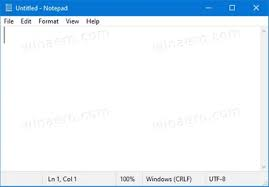
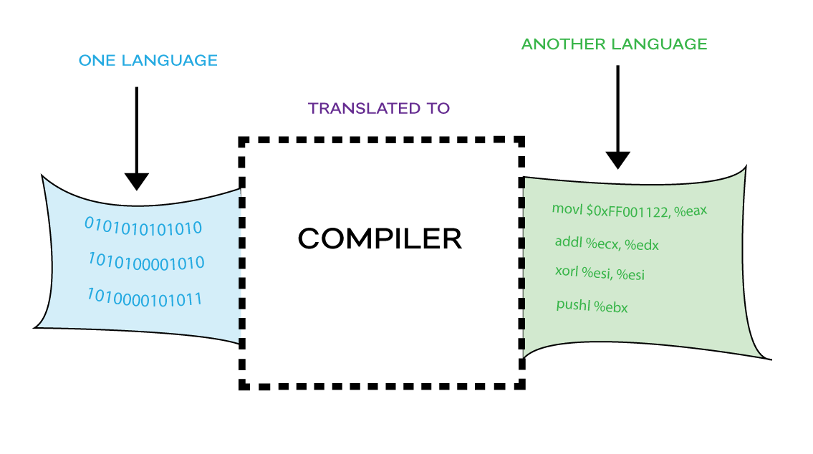
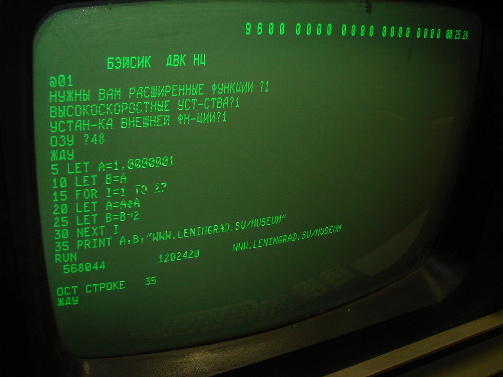

# PROGRAMMING-BASICS
A step by step detail guide to programming basics with python.


> Computer programming is an act of writing a step by step action to perform
   action by computer machine


**This guide is an attempt to give roadmap to learn computer programming basics with practical approach learn at your pace**


__Note__: *No prerequisites require to learn from this guide, execpt a computer/laptop. Beginners-Friendly :)*

## INTRODUCTION TO COMPUTER PROGRAM
before getting into complete explanation, let's first understand a computer program
> *computer program is a sequence of steps/instruction written in machine language to perfrom an action by a machine*

Two important thing to note:
* Sequence of instruction &
* machine/progamming language

understand this like, if someone ask you a way to school.

1. Go straight
2. Drive half a kilometer
3. take left
4. Drive one kilometer more
5. search for school at your left side

The above sequence of instructions is actually a Human action statements written in English Language, which instructs on how to reach school from a given starting point. This same sequence could have been given in Russian, Hindi, Urdu, or any other human language, provided the person seeking direction knows any of these languages.


Now, try to map the situation with a computer program which is a sequence of instructions written in a Computer Language to perform a specified task by the computer.

```
print("Hello, world!")
```

The above computer program instructs the computer to print __Hello, World!__ on the computer screen.

## ALGORITHM

From programming point of view, an algorithm is a step-by-step procedure to resolve any problem. An algorithm is an effective method expressed as a finite set of well-defined instructions.

Thus, a computer programmer lists down all the steps required to resolve a problem before writing the actual code.

* sum of N numbers
* fibonacci series
* factorial of Nth number 

## PROGRAMMING ENVIRONMENT

__Environment__ is actually a first setp to setup before writing our program, though __Environment__ Setup is not an element of any programming language but it simply implies a base on top of which we can do our programming.

To kick start your programming journey you need below tools:
* A Text editor like Notepad on windows OS
* A compiler to compile program into binary format
* An iterpretor to execute program directly

### Text Editor

A text editor is a software that is used to write computer programs. Your Windows machine must have a Notepad, which can be used to type programs. 



You can use this text editor(famous Notepad from Microsoft) to write computer program.

### Compiler

wikipedia
>  In computing, a compiler is a computer program that translates computer code written in one programming language (the source language) into another language (the target language). The name "compiler" is primarily used for programs that translate source code from a high-level programming language to a lower level language (e.g. assembly language, object code, or machine code) to create an executable program.




So, if you are going to write your program in any such language, which needs compilation like C, C++, Java and Pascal, etc., then you will need to install their compilers before you start programming

### Interpreter

wikipedia
>    In computer science, an interpreter is a computer program that directly executes instructions written in a programming or scripting     language, without requiring them previously to have been compiled into a machine language program.

An interpreter generally uses one of the following strategies for program execution:

    1. Parse the source code and perform its behavior directly;
    2. Translate source code into some efficient intermediate representation or object code and immediately execute that;
    3. Explicitly execute stored precompiled bytecode[1] made by a compiler and matched with the interpreter Virtual Machine.



So, if you are going to write your programs in PHP, Python, Perl, Ruby, etc., then you will need to install their interpreters before you start programming.


## Basics Syntax

Let's start writing some little code to get start with your programming journey :)

we will start Hello world program.

```
print("Hello World! My First Python program :)")
```
In C and Java, remember we first compiling the program and then execute. But in __python__ we directly execute due to interpreter.
Python does not require a semicolon (;) to terminate a statement, rather a new line always means termination of the statement.

### Comments 

popular way of commenting a line in *Python* /* ... */ or #, they are use to completely ignore line either in compiler or interpreter. 

* /* print("ignore this line:)") */ 
* #print("ignore this line:)") 

### Whitespaces

you can use any english, digits and special characeter to write your program like (a-z,A-Z.0-9,@,#,$,% etc) but there are 
are some characters which we use very frequently but they are invisible in your program and these characters are spaces, 
tabs (\t), new lines(\n). These characters are called whitespaces. 

| Whitespace |    Explanation   | Symbol     |
| ---------- | -----------------| ---------- |
| New Line   | To creat new line|  \n        |
| Tab        | Creat Tab        |   \t       |
| Space      | Creat space      | empty space|

### Semicolon

In python there is no need to put semicolon, except a colon require that we will see later section.

### Syntax Error

If you get this, it usually means you've misplaced a symbol or letter somewhere in your code.

**Common-Cause**

* forgetting to put quotes around a string
* forgetting a colon : when using if, else, for, while, or def.
* using = instead of == in a comparison
* using return and = in the same line
* mismatched number of open and close parentheses
* misspelling a keyword or function name
* inconsistent indentation
* using a keyword as a variable name
* using illegal characters (like spaces) in variable names
* wrong capitalization: remember that Python is case-sensitive

## Data Type

*Wikipedia*
>In computer science and computer programming, a data type (or simply type) is a set of possible values and a set of allowed operations on it. A data type tells the compiler or interpreter how the programmer intends to use the data. Most programming languages support basic data types of integer numbers (of varying sizes), floating-point numbers (which approximate real numbers), characters and Booleans. A data type constrains the possible values that an expression, such as a variable or a function, might take. This data type defines the operations that can be done on the data, the meaning of the data, and the way values of that type can be stored.


### Python Data Types

Python has five standard data types but this programming language does not make use of any keyword to specify a particular data type, rather Python is intelligent enough to understand a given data type automatically.

* Numbers
* String
* List
* Tuple
* Dictionary

Here, Number specifies all types of numbers including decimal numbers and string represents a sequence of characters with a length of 1 or more characters. For now, let's proceed with these two data types and skip List, Tuple, and Dictionary, which are advanced data types in Python.

## Variables

wikipedia
>In computer programming, a variable is an abstract storage location paired with an associated symbolic name, which contains some known or unknown quantity of information referred to as a value; or in simpler terms, a variable is a named container for a particular set of bits or type of data (like integer, float, string etc...). A variable can eventually be associated with or identified by a memory address. The variable name is the usual way to reference the stored value, in addition to referring to the variable itself, depending on the context. This separation of name and content allows the name to be used independently of the exact information it represents. The identifier in computer source code can be bound to a value during run time, and the value of the variable may thus change during the course of program execution.

In simple terms, variables are name give to memory location in computer to store data or value to process.

in python we do not mention the type of variable before using it unlike in C or Java.

```
a = 10
b = 7
print("sum of a & b :", a+b)
```

## Python Reserve Keyword

    |and	 |  exec   |	not   |
    |--------|---------|----------|
    |assert	 |  finally|    or    |
    |break	 |  for	   |    pass  |
    |class	 |  from   |    print |
    |continue|  global |    raise |
    |def	 |   if	   |    return|
    |del	 |   import|    try   |
    |elif	 |   in	   |    while |
    |else	 |   is	   |    with  |
    |except	 |  lambda |    yield |

Just keep in mind next time, never to use a variable from above reserved keyword list.


## Operators 

An operator in programming language tell compiler or interpreter to perform specific mathematical, logical or relational operation.

### Arithmatic  Operator

>a+b
>a-b

The above two + & - operator are widley use to perform calculations, therfore they are called arithmatic operator and expression 
are called arithmatic expression.


| Operator |             Description	                          |        Example        |
|----------|------------------------------------------------------|-----------------------|
| \+	   |            Adds two operands	                      |    A + B will give 30 |
| \-	   |            Subtracts second operand from the first   |   A - B will give -10 |
| \*	   |             Multiplies both operands	              |   A * B will give 200 |
| /	       |         Divides numerator by de-numerator	          |  / A will give 2      |
| %	       |         This gives remainder of an integer division  |  B % A will give 0    |


### Relational Operator

a = 10
b = 5

consider two variable with values 10 & 5, if try two compare then

> a > b

The greater than symbol *>* is a relational operator. Common relational operator are.


|Operator|	                       Description	                                                      |      Example           |
|--------|--------------------------------------------------------------------------------------------|------------------------|
|==	     |   Checks if the values of two operands are equal or not,if yes then condition becomes true.|   (A == B) is not true.|
|!=	     |    Checks if the values of two operands are equal or not.	                              |     (A != B) is true.  |
|>	     |    Checks if the value of left operand is greater than the value of right operand.         |   (A>B) is not true.   |
|<	     |    Checks if the value of left operand is less than the value of right operand.	          | (A < B) is true.       |
|>=	     |    Checks the value of left operand is greater than or equal to value of right operand.    |   (A>=B) is not true.  |
|<=	     |    Checks if value of left operand less than or equal to the value of right operand.	      | (A <= B) is true.      |

### Logical Operator

Logical operators are very important in any programming language and they help us take decisions based on certain conditions. Suppose we want to combine the result of two conditions, then logical AND and OR logical operators help us in producing the final result.


| Operator |	                                              Description	                                 |        Example       |
|----------|-------------------------------------------------------------------------------------------------|----------------------|
| &&	   | Called Logical AND operator. If both the operands are non-zero, then condition becomes true.	 |    (A && B) is false.|
| ||	   | Called Logical OR Operator. If any of the two operands is non-zero, then condition becomes true.|    (A || B) is true. |
| !	       | Called Logical NOT Operator. Use to reverses the logical state of its operand.                  | 	!(A && B) is true.  |